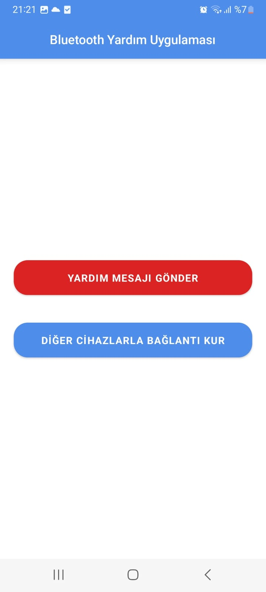
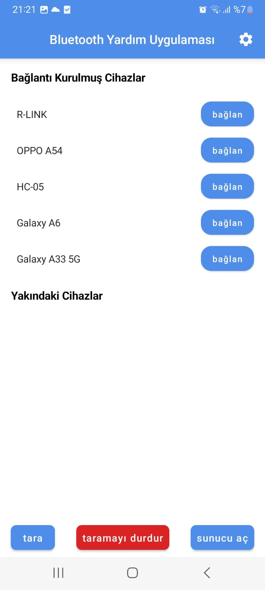
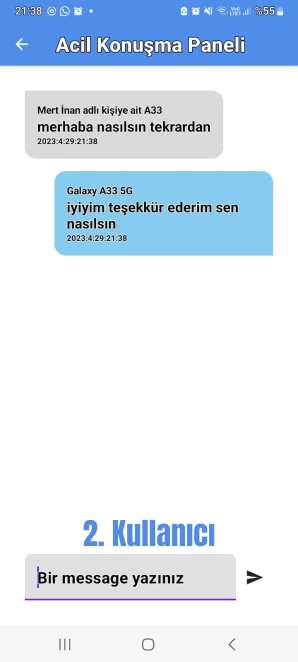
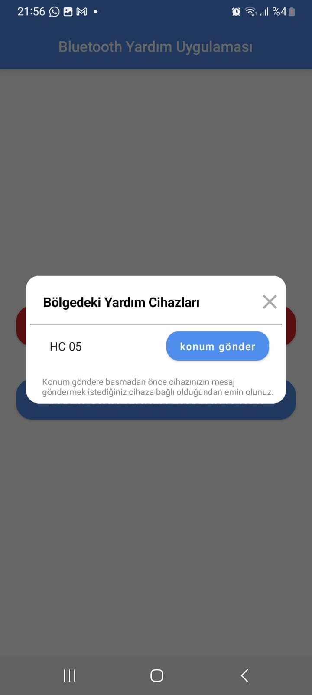
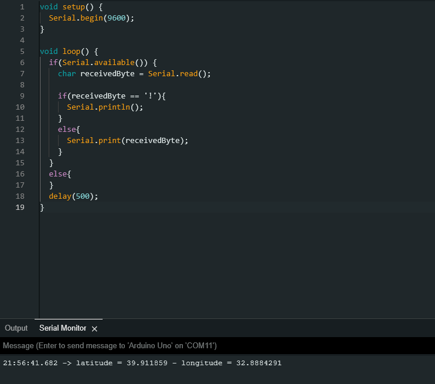
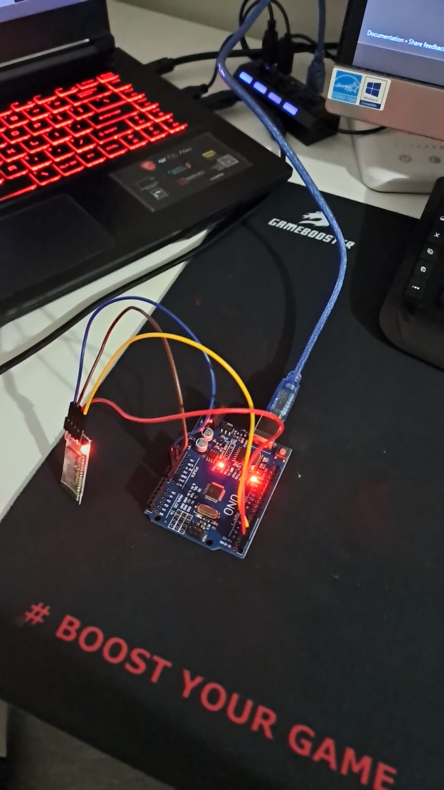

# BLUETOOTH RESCUE APP-EN

This application has been developed to facilitate communication between disaster victims and disaster response teams in moments when telecommunication is not available. The application consists of two different modules. The first module enables messaging between individuals by establishing a Bluetooth connection. This allows people to communicate with each other through the application. The second module involves sending the location of the disaster victim to a Bluetooth module connected to an Arduino or a similar processing device. This location information is then received by response teams in the vicinity. During our testing of this application, we utilized Arduino devices with HC-05 and HC-06 Bluetooth modules connected to them.

## 1. Inter-device communication
- The user taps on the "CONNECT WITH OTHER DEVICES" button on the main screen.
- The devices should have established a connection with each other.
- The connection between devices can be established within the application or through the device's connection settings.
- If two devices want to exchange messages, one of them presses the "Open Server" button to create a socket and waits for the other device to connect.
- The second device, which wants to engage in messaging, presses the "Connect to Server" button to connect to the device that has opened the server.
- If the connection between devices is successfully established, users are directed to the messaging screen.
- Once in the messaging screen, as long as the connection is maintained, users can exchange messages with each other. If the connection is lost, an error message is displayed, and the user is redirected to the previous page.
- User-to-user messages are saved within the phone's storage. If the connection between devices is reestablished, previous conversations are retrieved and displayed to the user.

  </img>
  </img>
  </img>

  </img>
  </img>

## 2. SEND HELP MESSAGE
- The user taps on the "SEND HELP MESSAGE" button on the main screen.
- When the button is pressed for the first time, the user is prompted to grant location permissions and ensure that the phone's location services are enabled. Without these permissions, the help message cannot be sent.
- The Arduino devices in the vicinity are scanned for a duration of 4 seconds. The devices found within this time period are displayed to the user.
- In order to send a help message to the devices, the user must have established a connection with them. The connection setup is done through the settings.
- When the user taps on "Send Location," the coordinates of the user are sent as a message to the Arduino device.
- If the location is successfully sent to the Arduino, a success message is displayed to the user. If an error occurs, an error message is shown.

  </img>
  </img>
  </img>

   </img>
   </img>
   
  The left image shows the coordinates sent to the user, displayed on the Arduino console. The right image displays an Arduino device with an HC-05 Bluetooth module connected to it.

## MAIN SCREENS OF APP

  </img>
  </img>
  </img>

## REFERENCES
- https://github.com/philipplackner/BluetoothChat/tree/Part3-DataTransfer
- https://developer.android.com/guide/topics/connectivity/bluetooth
- https://developer.android.com/reference/android/location/Location
- https://developer.android.com/training/data-storage/room

## TECHNOLOGIES

   
  
  

# BLUETOOTH YARDIM UYGULAMASI-TR

Bu uygulama telekominsayonun sağlanamadığı afet anlarında afetzedeler ve afet müdahele ekipleri arasında iletişimi sağlamak amacıyla geliştirilmiştir. 
Uygulamanın kendi içerisinde iki farklı modülü bulunmaktadır. İlk modül bluetooth bağlantısı sağlanmış kişiler arası mesajlaşmaya olanak sağlamaktadır. 
İkinci modül ise afetzedenin konumunu çevrede müdahele ekipleri tarafından kurulmuş arduino veya işlemci cihazına bağlı bluetooth modülüne gönderilmesidir. 
Biz bu uygulamayı test ederken elimizdeki arduino cihazına HC-05, ve HC-06 modüllerini bağlayarak test ettik.

## 1. Cihazlar Arası Haberleşme
- Kullanıcı ana ekrandan "DİĞER CİHAZLARLA BAĞLANTI KUR" butonuna basar.
- Cihazların birbiriyle bağlantı kurmuş olması gerekmektedir.
- Cihazlar arası bağlantı uygulama içerisinden kurulabilmektedir. Aynı şekilde cihazlar arası bağlantı ayarlar kısmından da kurulabilir.
- Mesajlaşmak isteyen iki cihazdan biri sunucu aç butonuna basarak soket oluşturur ve karşı cihazın bağlanmasını bekler.
- Mesajlaşmak isteyen ikinci cihaz ise sunucu açmış olan cihaza bağlan butonuna basarak bağlanır.
- Cihazlar arası bağlantı başarıyla sağlanırsa kullanıcılar mesajlaşma ekranına yönlendirilir.
- Mesajlaşma ekranına gelmiş kullanıcılar bağlantı korunduğu sürece birbiriyle mesajlaşabilirler. Bağlantı bozulduğunda kullanıcıya hata verilir ve önceki sayfaya yönlendirilir.
- Kullanıcılar arası mesajlar telefonun içerisine kayıt edilir. Cihazlar arası bağlantı tekrar kurulursa önceki yazışmalar çekilerek kullanıcıya gösterilir.

  </img>
  </img>
  </img>

  </img>
  </img>

## 2. Yardım Mesajı Gönderme
- Kullanıcı ana ekrandan "YARDIM MESAJI GÖNDER" butonuna basar.
- Butona ilk defa basıldığında kullanıcıdan konum izinleri istenir ve telefon içinden konumun açık olması istenir. Bu iki izin olmadan yardım mesajı gönderilemez.
- Çevredeki arduino cihazlar 4 saniye boyunca taranır. 4 saniye içerisinde bulunan cihazlar kullanıcıya gösterilir.
- Cihazlara yardım mesajı gönderilebilmesi için kullanıcının cihazlarla bağlantı kurmuş olması gerekmektedir. Bağlantı kurma işlemi ayarlardan yapılır.
- Kullanıcı "konum gönder" e basınca arduino cihaza mesaj olarak kullanıcının kordinatları gönderilir. 
- Konum başarıyla arduionaya gönderildiğinde kullanıcıya mesaj gösterilir, hatayla karşılaşılırsa hata gösterilir. 

  </img>
  </img>
  </img>

   </img>
   </img>
   
  Soldaki resimde kullanıcıya gönderilmiş olan kordinatlar arduino konsolunda gözükmektedir. Sağdaki resimde ise HC-05 bluetooth modülü bağlanmış arduino cihazı gösterilmektedir.

## UYGULAMANIN ANA SAYFALARI

  </img>
  </img>
  </img>

## YARDIM ALINAN KAYNAKLAR
- https://github.com/philipplackner/BluetoothChat/tree/Part3-DataTransfer
- https://developer.android.com/guide/topics/connectivity/bluetooth
- https://developer.android.com/reference/android/location/Location
- https://developer.android.com/training/data-storage/room

## KULLANILAN TEKNOLOJİLER

   
  
  

