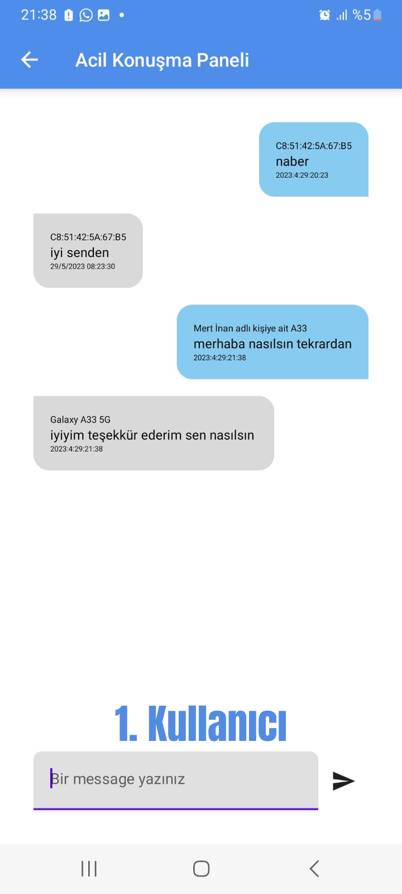
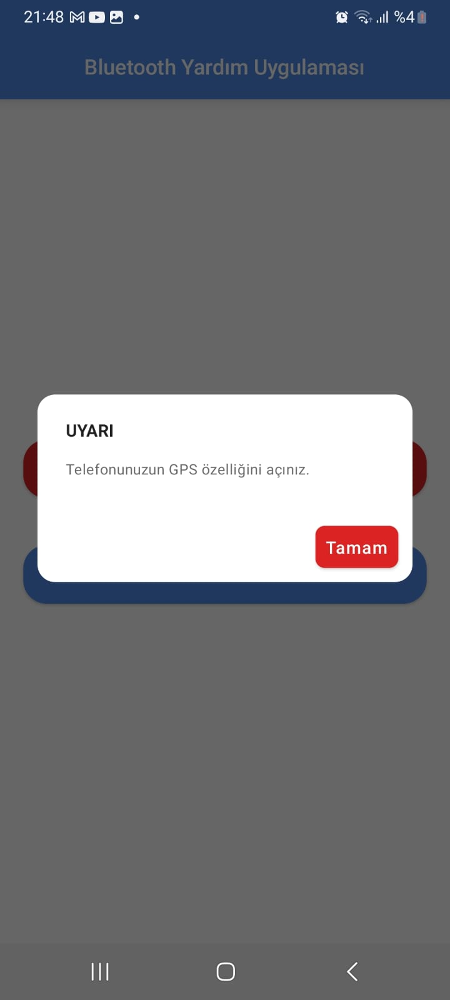

# BLUETOOTH YARDIM UYGULAMASI

Bu uygulama telekominsayonun sağlanamadığı afet anlarında afetzedeler ve afet müdahele ekipleri arasında iletişimi sağlamak amacıyla geliştirilmiştir. 
Uygulamanın kendi içerisinde iki farklı modülü bulunmaktadır. İlk modül bluetooth bağlantısı sağlanmış kişiler arası mesajlaşmaya olanak sağlamaktadır. 
İkinci modül ise afetzedenin konumunu çevrede müdahele ekipleri tarafından kurulmuş arduino veya işlemci cihazına bağlı bluetooth modülüne gönderilmesidir. 
Biz bu uygulamayı test ederken elimizdeki arduino cihazına HC-05, ve HC-06 modüllerini bağlayarak test ettik.

## 1. Cihazlar Arası Haberleşme
- Kullanıcı ana ekrandan "DİĞER CİHAZLARLA BAĞLANTI KUR" butonuna basar.
- Cihazların birbiriyle bağlantı kurmuş olması gerekmektedir.
- Cihazlar arası bağlantı uygulama içerisinden kurulabilmektedir. Aynı şekilde cihazlar arası bağlantı ayarlar kısmından da kurulabilir.
- Mesajlaşmak isteyen iki cihazdan biri sunucu aç butonuna basarak soket oluşturur ve karşı cihazın bağlanmasını bekler.
- Mesajlaşmak isteyen ikinci cihaz ise sunucu açmış olan cihaza bağlan butonuna basarak bağlanır.
- Cihazlar arası bağlantı başarıyla sağlanırsa kullanıcılar mesajlaşma ekranına yönlendirilir.
- Mesajlaşma ekranına gelmiş kullanıcılar bağlantı korunduğu sürece birbiriyle mesajlaşabilirler. Bağlantı bozulduğunda kullanıcıya hata verilir ve önceki sayfaya yönlendirilir.

  </img>
  </img>
  </img>

  </img>
  </img>

## 2. Yardım Mesajı Gönderme
- Kullanıcı ana ekrandan "YARDIM MESAJI GÖNDER" butonuna basar.
- Butona ilk defa basıldığında kullanıcıdan konum izinleri istenir ve telefon içinden konumun açık olması istenir. Bu iki izin yardım mesajı gönderilemez.
- Çevredeki arduino cihazlar 4 saniye boyunca taranır. 4 saniye içerisinde bulunan cihazlar kullanıcıya gösterilir.
- Cihazlara yardım mesajı gönderilebilmesi için kullanıcının cihazlarla bağlantı kurmuş olması gerekmektedir. Bağlantı kurma işlemi ayarlardan yapılır.
- Kullanıcı "konum gönder" e basınca arduino cihaza mesaj kullanıcının kordinatları gönderilir. 
- Konum başarıyla arduionaya gönderildiğinde kullanıcıya mesaj gösterilir, hatayla karşılaşılırsa hata gösterilir. 

  </img>
  </img>
  </img>

   </img>
   </img>
   
  Soldaki resimde kullanıcıya gönderilmiş olan kordinatlar arduino konsolunda gözükmektedir. Sağdaki resimde ise HC-05 bluetooth modülü bağlanmış arduino cihazı gösterilmektedir.

## UYGULAMANIN ANA SAYFALARI

  </img>
  </img>
  </img>

## YARDIM ALINAN KAYNAKLAR
- https://github.com/philipplackner/BluetoothChat/tree/Part3-DataTransfer
- https://developer.android.com/guide/topics/connectivity/bluetooth
- https://developer.android.com/reference/android/location/Location

## KULLANILAN TEKNOLOJİLER

   
  

